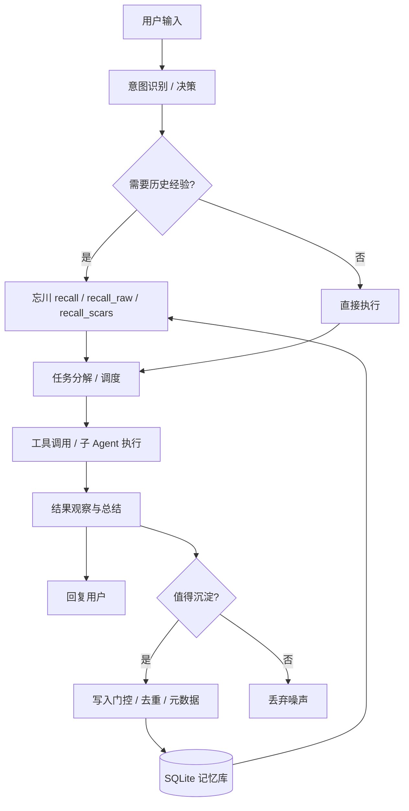
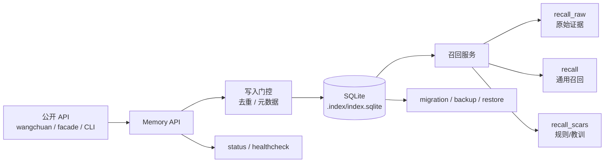

# 忘川 (WangChuan)


<h1 align="center">忘川 · WangChuan</h1>

<p align="center">
  <strong>证据感知的智能体记忆引擎</strong><br />
  Evidence-Aware Memory Engine for AI Agents
</p>

<p align="center">
  <a href="https://www.python.org/downloads/"></a>
  <a href="https://pypi.org/project/wangchuan-memory/"></a>
  <a href="LICENSE"></a>
  <a href="docs/RELEASE_ALPHA.md"></a>
  <a href="#-测试与发布-gate"></a>
</p>

<p align="center">
  忘川是专门为智能体（Agent）设计的长期记忆引擎。<br />
  它不只是把内容“存进去再搜出来”，而是让记忆成为<strong>可信、可追溯、可治理</strong>的资产。
</p>

<p align="center">
  <strong>> 忘川不是另一个向量数据库。</strong><br />
  它是一个面向 Agent 的<strong>证据感知记忆系统</strong>。
</p>

<p align="center">
  <a href="./README_EN.md">English</a> ·
  <a href="docs/QUICKSTART.md">快速开始</a> ·
  <a href="docs/API_CONTRACT.md">API 契约</a> ·
  <a href="docs/FAQ.md">FAQ</a>
</p>

---

## 📜 设计哲学

### 为什么叫“忘川”？

在中国神话中，**忘川**是幽冥界的一条河流，亡魂渡过忘川便会忘却前世记忆。但我们选择这个名字，恰恰是**反用其意**：

> **忘川，是不忘之川。**

我们希望智能体的记忆不是一片混沌的噪声，而是一条**清晰、可追溯、可治理的记忆之河**。每一条记忆都有源头、有痕迹、有生命——它们会升温、会冷却、会遗忘、会沉淀，最终成为智能体长期进化的基石。

------

## ✨ 一句话说明

> 忘川让智能体知道：**记住了什么、为什么召回、证据从哪来、能不能信。**

普通记忆系统通常只回答“搜到了什么”。  
忘川进一步回答：

- 这条记忆来自哪里？
- 它是原始证据、结构化记忆，还是规则/教训？
- 为什么这次会被召回？
- 这条记忆是否经过治理、去重和门控？
- 当前数据库 schema 是哪个版本，能否备份恢复？

---

## 🧭 当前状态

| 项目          | 状态                                                         |
| :------------ | :----------------------------------------------------------- |
| 发布阶段      | `3.0.0-alpha`                                                |
| 适用范围      | 公开 alpha 试用 / 内部集成验证 / 源码评估                    |
| 本地 gate     | `release_check.py` PASS，`pytest -q` 最近为 `38 passed, 1 skipped` |
| Python        | 声明支持 3.10+；本地已验证 3.11 / 3.12                       |
| Stable 前仍需 | GitHub Actions 远端全绿 + 3 个真实外部试用反馈闭环           |

> 可以用于内部和 alpha/beta 试用；暂不建议宣称为 mature stable production software。

---

## 🚀 快速开始

### 安装

```bash
pip install wangchuan-memory
```

从源码安装：

```bash
git clone <仓库地址>
cd wangchuan-memory
pip install -e .
```

> 包名是 `wangchuan-memory`，Python 导入名是 `wangchuan`。

### Python API

```python
from wangchuan import remember, recall, status

remember(
    "用户喜欢简洁回复，带明确行动项",
    importance=0.8,
    tags=["preference", "style"],
)

results = recall("我应该怎么回复用户？", limit=3)
for item in results:
    print(item["content"])
    print(item.get("recall_explain"))

print(status()["message"])
```

也可以直接跑完整 demo：

```bash
python3 examples/basic_memory.py
```

### CLI

源码环境推荐使用：

```bash
python3 -m wangchuan status --json
python3 -m wangchuan remember "用户偏好简洁回复" --importance 0.9 --tag preference --json
python3 -m wangchuan recall "用户偏好" --limit 3 --json
python3 -m wangchuan recall-raw "原话" --limit 3 --json
python3 -m wangchuan recall-scars "规则和教训" --limit 3 --json
python3 -m wangchuan paths --json
```

安装后也可以使用 console script：

```bash
wangchuan status --json
```

完整 CLI demo：

```bash
bash examples/cli_demo.sh
```

---

## 🧠 内核能力

忘川不是单点功能集合，而是一套围绕“长期记忆如何可信增长”的记忆内核。  
这一层回答的是：**记忆如何形成、如何保鲜、如何衰减、如何共振、如何跨实例传承。**

| 能力                     | 说明                                    |
| :----------------------- | :-------------------------------------- |
| **🌡️ 温度分层**           | hot / warm / cold / dormant 生命周期    |
| **📈 置信度**             | 记忆重要性、可信度、质量评分            |
| **🧭 共振内核**           | 多线索召回与上下文共振                  |
| **🧠 意识体系**           | 与天工九层体系对接，支撑长期经验演化    |
| **🕰️ 遗忘曲线**           | 随时间降低低价值记忆权重                |
| **🧬 跨实例继承**         | 通过可移植 SQLite / 文档 / 契约迁移经验 |
| **🧱 Schema / Migration** | schema version、幂等迁移、备份恢复      |
| **🛡️ 治理内核**           | 写入门控、去重、清理、安全 gate         |

### 🌡️ 温度分层：让记忆有生命周期

忘川把记忆看成会变化的资产，而不是一条永远等价的记录。

- **Hot memory**：近期高频、高价值、应优先召回
- **Warm memory**：仍有价值，但不应压过当前上下文
- **Cold memory**：低频或历史背景，必要时才召回
- **Dormant memory**：长期沉睡，只在强相关场景被唤醒

温度分层的目标是避免“旧记忆永远霸榜”，让 Agent 的记忆随使用自然更新。

### 📈 置信度与质量评分：不是所有记忆都同等可信

忘川会围绕记忆维护多种质量信号：

- `importance`：这条记忆有多重要
- `confidence`：这条记忆有多可信
- `quality_score`：综合质量评分
- `evidence_level`：原始证据、总结记忆还是规则教训
- `promotion_state`：是否经过提升、确认或沉淀

这让召回不只是“相似度排序”，还可以考虑可信度、来源、质量和治理状态。

### 🕰️ 遗忘曲线：让低价值记忆自然退场

长期运行的 Agent 最大问题不是“记不住”，而是“什么都记”。

忘川通过遗忘与清理机制降低低价值记忆的干扰：

- 久未命中的记忆降低优先级
- 测试噪声、运行时噪声不进入主记忆
- 重复规则、重复反思可被清理
- 低质量候选不会轻易提升为长期记忆

遗忘不是删除一切，而是让召回系统保持清醒。

### 🧭 共振内核：让记忆和当前任务发生关系

忘川的召回不是孤立搜索，而是围绕当前任务形成“记忆共振”：

- 结合 query、角色、上下文、历史反馈
- 区分原始证据、结构化事实、规则/教训
- 输出可解释的召回线索
- 为决策层和调度层提供历史经验支撑

共振内核的目标是让 Agent 不只“搜到相似文本”，而是召回真正能影响当前决策的经验。

### 🧠 意识体系接口：记忆服务于长期智能

在天工开智九层体系中，忘川是 L2 记忆层，但它与多个层协作：

- 与 **天心** 协作：为决策提供历史经验
- 与 **璇玑** 协作：为任务分解和调度提供上下文
- 与 **日新** 协作：把执行反馈转化为可沉淀经验
- 与 **规矩** 协作：避免越权、污染和错误写入

因此忘川不是“外挂数据库”，而是长期智能的经验底座。

### 🧬 跨实例继承：让经验可以迁移

忘川的记忆以本地 SQLite、schema version、文档契约和发布 gate 为基础，天然适合迁移和复制：

- 复制 SQLite 文件即可备份 / 恢复
- schema version 可检查当前数据库结构
- migration 幂等，便于升级
- API contract 让不同实例共享稳定接入面
- README / FAQ / FEEDBACK_TEMPLATE 让外部实例反馈可复现

这意味着一个 Agent 实例沉淀的经验，可以被审计、备份、迁移，并在另一个实例中继续发挥价值。

---

## 🚀 核心功能

如果说“内核能力”解释忘川为什么不同，这一层则说明忘川当前能直接做什么。

| 功能           | 说明                                |
| :------------- | :---------------------------------- |
| **🧩 分层召回** | recall / recall_raw / recall_scars  |
| **🔗 证据边界** | source / session / provenance       |
| **🧹 记忆卫生** | gate / dedupe / cleanup             |
| **📊 可观测性** | status / healthcheck / release gate |
| **💾 备份恢复** | SQLite 单文件备份                   |
| **🧰 CLI 工具** | status / paths / cleanup / facade   |
| **🔌 MCP 支持** | optional MCP server                 |
| **📦 发布纪律** | release_check / build / wheel smoke |

### 🧩 分层召回

| API              | 用途                                        |
| :--------------- | :------------------------------------------ |
| `recall()`       | 通用记忆召回，适合日常上下文                |
| `recall_raw()`   | 原始证据召回，偏 source / provenance / 原话 |
| `recall_scars()` | 规则、教训、决策经验等“伤疤记忆”            |

### 🔗 证据边界

每条记忆可以携带：

- `source_anchor`：来源锚点
- `source_session`：来源会话
- `turn_signature`：轮次签名
- `provenance`：来源链
- `recall_explain`：召回解释

忘川不仅回答“召回了什么”，还尽量回答“为什么是它、它从哪来、是否可信”。

### 🧹 记忆卫生

- **写入门控**：阻断测试噪声、运行时噪声、低价值条目
- **去重机制**：减少重复反思、重复事件、重复规则
- **历史清理**：配合 cleanup / audit 命令治理长期记忆库
- **来源可控**：每条记忆尽量保留来源边界，避免“黑盒记忆”

### 📊 可观测性

- `status()`：查看运行状态、schema version、召回状态
- `healthcheck()`：查看健康检查结果
- `paths()`：查看数据目录和数据库路径
- `facade-health`：检查稳定 facade 健康状态
- `scripts/release_check.py`：发布前安全 gate

### 💾 备份与恢复

默认数据库路径：

```text
$WANGCHUAN_HOME/.index/index.sqlite
```

备份最小单位就是 SQLite 文件：

```bash
cp .index/index.sqlite /path/to/backup/index.sqlite
```

恢复后运行：

```bash
python3 -m wangchuan healthcheck --json
```

### 🧰 CLI 工具

常用命令包括：

```bash
python3 -m wangchuan status --json
python3 -m wangchuan paths --json
python3 -m wangchuan healthcheck --json
python3 -m wangchuan remember "用户偏好简洁回复" --importance 0.9 --tag preference --json
python3 -m wangchuan recall "用户偏好" --limit 3 --json
python3 -m wangchuan recall-raw "原话" --limit 3 --json
python3 -m wangchuan recall-scars "规则和教训" --limit 3 --json
```

### 🔌 MCP 支持

MCP 是 optional，不随基础包默认安装：

```bash
pip install 'wangchuan-memory[mcp]'
python3 -m wangchuan.mcp_server
```

稳定 MCP tool 名称：

| Tool                   | 说明          |
| :--------------------- | :------------ |
| `memory_write`         | 写入记忆      |
| `memory_search`        | 通用召回      |
| `memory_search_raw`    | 原始证据召回  |
| `memory_search_scars`  | 规则/教训召回 |
| `memory_status`        | 查看状态      |
| `memory_healthcheck`   | 健康检查      |
| `memory_recent`        | 最近记忆      |
| `memory_search_by_tag` | 按标签搜索    |

更多说明见：[`docs/MCP.md`](docs/MCP.md)。

### 📦 发布纪律

忘川把“能跑”与“能发布”分开治理：

- `release_check.py` 检查 runtime 文件、密钥、本机路径、旧包引用等
- `pytest -q` 固定 first-run / recall / CLI / migration / docs / examples 主线
- `python -m build` 验证 wheel / sdist
- wheel install smoke 验证非 editable 安装

---

## 🧬 与天工开智的关系

**天工开智**是一套面向 AI 智能体的九层 Agent OS 架构。忘川是其中的 **L2 记忆层**。

| 层级 | 名称     | 职责               |
| ---: | :------- | :----------------- |
|   L1 | 天心     | 核心决策与推理     |
|   L2 | **忘川** | 长期记忆与经验治理 |
|   L3 | 百工     | 技能与工具封装     |
|   L4 | 利器     | 外部工具接入       |
|   L5 | 明察     | 多模态感知         |
|   L6 | 力行     | 行动执行           |
|   L7 | 规矩     | 安全与权限         |
|   L8 | 璇玑     | 任务调度与编排     |
|   L9 | 日新     | 自我进化与反馈闭环 |

忘川在天工中承担两个角色：

- **召回侧**：为决策与调度提供历史经验
- **写入侧**：将高质量执行经验沉淀为长期记忆

但忘川并不要求你采用完整天工架构。  
它可以作为通用记忆引擎，独立集成到其他 Agent 框架或 AI 应用中。

---

## 🔄 记忆闭环



这个闭环的目标是：

> 每一次交互都不是终点，而是下一次智能的起点。

---

## 🧱 架构概览



核心阅读路径：

1. `src/wangchuan/__init__.py` — 稳定公开入口
2. `src/wangchuan/memory_api.py` — 运行期记忆 API
3. `src/wangchuan/recall_service.py` — 召回服务入口
4. `src/wangchuan/v3/pipeline_v3.py` — 当前内部实现承载层

> `wangchuan.v3.*` 是 internal implementation carrier，不是推荐外部稳定导入面。

更多说明见：[`docs/ARCHITECTURE.md`](docs/ARCHITECTURE.md)。

---

## 🧾 稳定 API

稳定 API 只承诺：

```python
from wangchuan import Memory
from wangchuan import remember, recall, recall_raw, recall_scars
from wangchuan import status, healthcheck, task_resume
from wangchuan.facade import version, health, capabilities, invoke
```

详细边界见：[`docs/API_CONTRACT.md`](docs/API_CONTRACT.md)。

---

## 🖥️ CLI 常用命令

| 命令                                              | 用途                 |
| :------------------------------------------------ | :------------------- |
| `python3 -m wangchuan status --json`              | 查看运行状态         |
| `python3 -m wangchuan healthcheck --json`         | 运行健康检查         |
| `python3 -m wangchuan paths --json`               | 查看数据路径         |
| `python3 -m wangchuan remember "..." --json`      | 写入记忆             |
| `python3 -m wangchuan recall "..." --json`        | 通用召回             |
| `python3 -m wangchuan recall-raw "..." --json`    | 原始证据召回         |
| `python3 -m wangchuan recall-scars "..." --json`  | 规则/教训召回        |
| `python3 -m wangchuan facade-version --json`      | 查看 facade 版本     |
| `python3 -m wangchuan facade-health --json`       | 查看 facade 健康状态 |
| `python3 -m wangchuan facade-capabilities --json` | 查看 facade 能力     |

更多命令见：[`docs/CLI.md`](docs/CLI.md)。

---

## 💾 数据位置与备份

默认数据库路径：

```text
$WANGCHUAN_HOME/.index/index.sqlite
```

如果没有设置 `WANGCHUAN_HOME`，忘川会从当前 workspace root 解析路径。

`.wangchuan/memory.db` 属于历史兼容路径，不是当前默认主库。

备份最小单位就是 SQLite 文件：

```bash
cp .index/index.sqlite /path/to/backup/index.sqlite
```

更多说明见：[`docs/STORAGE.md`](docs/STORAGE.md)。

---

## 🔌 MCP 支持

MCP 是 optional，不随基础包默认安装。

```bash
pip install 'wangchuan-memory[mcp]'
python3 -m wangchuan.mcp_server
```

稳定 MCP tool 名称：

| Tool                   | 说明          |
| :--------------------- | :------------ |
| `memory_write`         | 写入记忆      |
| `memory_search`        | 通用召回      |
| `memory_search_raw`    | 原始证据召回  |
| `memory_search_scars`  | 规则/教训召回 |
| `memory_status`        | 查看状态      |
| `memory_healthcheck`   | 健康检查      |
| `memory_recent`        | 最近记忆      |
| `memory_search_by_tag` | 按标签搜索    |

更多说明见：[`docs/MCP.md`](docs/MCP.md)。

---

## 🧪 测试与发布 gate

本地常用验证：

```bash
python scripts/release_check.py
pytest -q
python -m build
# wheel install smoke
```

当前本地 gate 最近结果：

| Gate                 | 最近结果               |
| :------------------- | :--------------------- |
| `release_check.py`   | `OVERALL PASS`         |
| `pytest -q`          | `38 passed, 1 skipped` |
| build artifact check | 通过                   |
| wheel install smoke  | 通过                   |

stable 前仍需：

- GitHub Actions 远端实跑全绿
- Python 3.10 / 3.11 / 3.12 CI 全绿
- 至少 3 个真实外部试用反馈闭环

---

## 📚 文档导航

| 文档                                        | 用途                        |
| :------------------------------------------ | :-------------------------- |
| [快速开始](docs/QUICKSTART.md)              | 5 分钟完成首次成功          |
| [CLI 参考](docs/CLI.md)                     | 命令说明                    |
| [MCP 说明](docs/MCP.md)                     | MCP 安装与 tool 名称        |
| [存储说明](docs/STORAGE.md)                 | 数据路径、备份、恢复        |
| [FAQ](docs/FAQ.md)                          | 常见问题                    |
| [API 契约](docs/API_CONTRACT.md)            | 稳定 API 边界               |
| [弃用策略](docs/DEPRECATION_POLICY.md)      | 兼容与 breaking change 规则 |
| [架构说明](docs/ARCHITECTURE.md)            | 分层架构与内部边界          |
| [排障指南](docs/TROUBLESHOOTING.md)         | 常见错误处理                |
| [Alpha 试用指南](docs/ALPHA_TRIAL_GUIDE.md) | 外部试用流程                |
| [反馈模板](docs/FEEDBACK_TEMPLATE.md)       | 反馈收集格式                |
| [发布说明](docs/RELEASE_ALPHA.md)           | 当前 alpha 状态             |

---

## 🤝 贡献

欢迎 issue、PR、文档改进和真实使用案例反馈。

提交问题时请尽量提供：

1. 操作系统与 Python 版本
2. 安装方式
3. 写入内容
4. 查询语句
5. 期待结果
6. 实际结果

详见：[`CONTRIBUTING.md`](CONTRIBUTING.md)。

---

## 📋 设计原则

> **智能体记忆不仅应该是持久的。它应该是可解释的、分层的和可治理的。**

忘川遵循这一理念构建，让智能体记忆从“黑盒噪声”变为“可信资产”。

---

## 📜 许可证

MIT License。见 [`LICENSE`](LICENSE)。

---

<p align="center">
  如果忘川对你有帮助，欢迎给一个 ⭐ Star。
</p>

